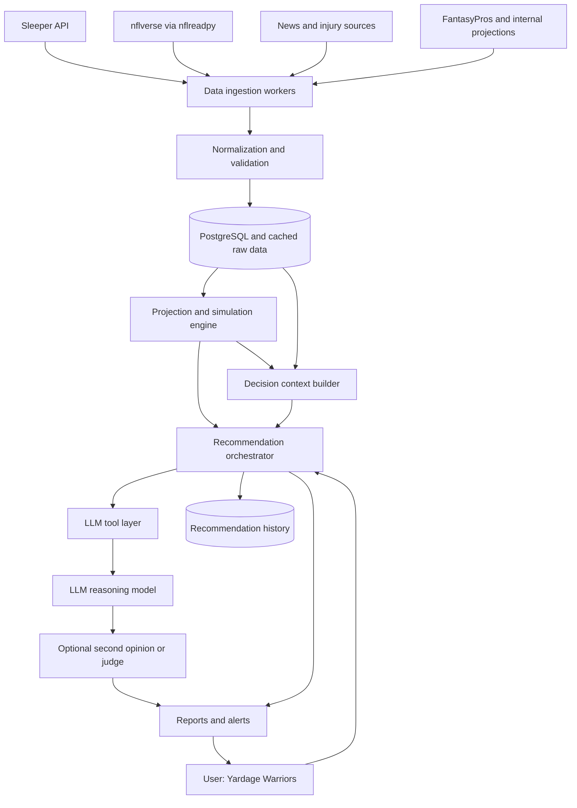
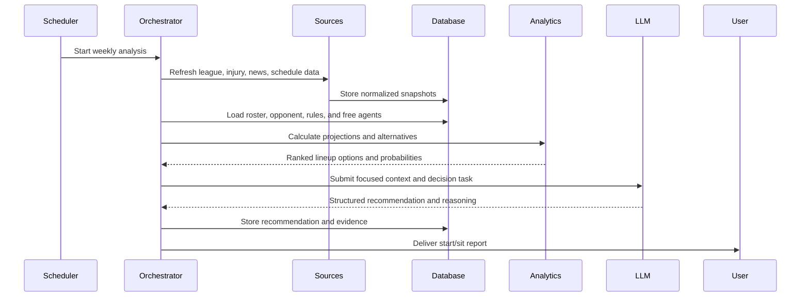

# Fantasy Football LLM Agent - High-Level Design

## 1. Purpose

The system is a read-only fantasy-football decision assistant for the user's Sleeper team, **Yardage Warriors**. It gathers league and NFL data, calculates repeatable projections, asks an LLM to investigate and explain decisions, and delivers recommendations that the user applies manually in Sleeper.

The system does not place waiver claims, change lineups, execute trades, or modify league settings.

## 2. Objectives

- Produce evidence-based weekly start/sit recommendations.
- Identify useful waiver-wire additions and potential drops.
- Evaluate trade opportunities using the actual league context.
- Estimate matchup, playoff, and roster outcomes.
- Preserve the data and reasoning behind every recommendation.
- Improve over time through backtesting and outcome measurement.

## 3. Non-Goals

- Automating actions in Sleeper without an officially supported write API.
- Replacing statistical projections with unverified LLM guesses.
- Treating model confidence as a guarantee.
- Supporting every sports platform in the first release.
- Building a general-purpose chatbot before the data workflow is reliable.

## 4. High-Level Architecture



## 5. Component Responsibilities

### 5.1 Data Ingestion

Connects to external providers, retrieves data, records fetch timestamps, handles retries, and stores raw responses when useful for debugging.

Initial connectors:

- Sleeper league, roster, matchup, transaction, draft, and player endpoints
- nflverse via `nflreadpy` for schedules, rosters, weekly rosters, player stats, snap counts, injuries, depth charts, player IDs, and fantasy opportunity data
- A separate news feed for editorial reports and breaking updates
- FantasyPros weekly projection connector
- An internal projection model using nflverse inputs

The FantasyPros v2 NFL projections endpoint returns projected statistics and
provider scoring metadata; it does not accept a scoring-format query parameter.
League-specific STD, PPR, or half-PPR points must be calculated downstream.
The free tier may return a successful limited response with no player records,
so ingestion must preserve that response and mark the data as unavailable
instead of treating it as a transport failure.

Connectors should be isolated behind provider-specific interfaces so one provider can be replaced without changing recommendation logic.

### 5.2 Normalization and Validation

Converts provider-specific responses into internal models. It should:

- Normalize player, team, user, roster, and league identifiers.
- Preserve the original provider ID for traceability.
- Handle missing, stale, or conflicting fields.
- Attach `source`, `retrieved_at`, and confidence metadata.
- Reject malformed data before it reaches analytics or the LLM.

### 5.3 Storage Layer

PostgreSQL stores current and historical normalized data. Raw payloads may be stored in object storage or a JSON column when replay and debugging are valuable.

Core entities:

```text
League
LeagueSettings
User
Roster
Player
PlayerStatus
Game
PlayerStatistic
Projection
Transaction
Draft
DraftPick
Recommendation
RecommendationEvidence
RecommendationOutcome
DataFetch
```

Important constraints:

- Use provider IDs as external keys and internal immutable IDs where needed.
- Keep historical records instead of overwriting time-sensitive values.
- Timestamp every projection, injury status, and recommendation.
- Never store API keys or secrets in source control.

### 5.4 Analytics and Simulation Engine

Performs deterministic calculations independently of the LLM:

- Expected points, floor, and ceiling
- Position eligibility and roster fit
- Replacement value
- Matchup and schedule strength
- Injury and playing-time adjustments
- Recent usage, targets, touches, and red-zone involvement
- Start/sit comparisons
- Matchup win probability
- Trade and playoff simulations

The engine should expose versioned inputs and calculation versions so historical recommendations can be reproduced.

### 5.5 Projection Layer

Normalizes FantasyPros projections and internal model output into one contract.
The layer preserves underlying projected statistics and independently calculates
fantasy points using the Sleeper league scoring settings. It compares external
and internal projections before passing a focused result to the LLM.

Each projection records the canonical player ID, external IDs, season, week,
position, scoring format, underlying stats, expected points, uncertainty fields,
source, model version, and generation timestamp.

### 5.6 Recommendation Orchestrator

Coordinates a user question or scheduled weekly analysis. It should:

1. Identify the league and current week.
2. Load the relevant roster, opponent, rules, and available players.
3. Check data freshness.
4. Request deterministic analytics.
5. Give the LLM only the context needed for the decision.
6. Validate the returned structured recommendation.
7. Store the evidence, model metadata, and result.
8. Deliver the report to the user.

The orchestrator owns business rules. The LLM may request tools, but it should not bypass data validation or directly access external credentials.

Initial freshness rules are 24 hours for schedules, 6 hours for statistics, 1
hour for injuries, 30 minutes for news, and 12 hours for projections. The
`freshness_rules.py` module accepts both category names and the emitted provider
names `fantasypros` and `nflverse`, evaluates these thresholds, and marks stale
inputs before they reach analytics. Future retrieval timestamps are rejected as
clock skew or corrupted metadata rather than treated as fresh.

Free agents are derived from the Sleeper player index by subtracting player IDs
present on all league rosters, then filtering for availability and position.

### 5.7 Decision Context Builder

Transforms normalized records and analytics into focused, decision-specific context. It should create separate context shapes for start/sit, waiver, trade, roster, and matchup decisions rather than sending the entire league snapshot to the model.

Each context should preserve:

- Source and retrieval timestamps
- Projection and calculation versions
- Relevant league rules
- Facts, projections, assumptions, and uncertainty
- Only the players, teams, and time window relevant to the decision

### 5.8 LLM Tool Layer

Provides narrow, read-only functions such as:

```text
get_my_roster
get_league_context
get_weekly_opponent
get_free_agents
get_player_profile
get_player_stats
get_player_news
get_injury_report
get_schedule
get_standings
get_transactions
simulate_matchup
simulate_trade
```

Tools should return structured JSON with source timestamps. Large datasets should be filtered before they reach the model.

### 5.9 Report and Alert Delivery

The first delivery mechanism can be a generated report or command-line output. Later options include a web dashboard, email, or messaging integration.

Every report should show:

- Recommendation
- Relevant player or team
- Supporting facts
- Projection or expected change
- Risks and assumptions
- Confidence
- Data freshness
- Manual action required in Sleeper

## 6. Primary Data Flow: Weekly Start/Sit



## 7. Primary Data Flow: User Question

For a question such as “Should I drop Player X?” the orchestrator should load Player X's roster status, recent production, news, injury information, schedule, available replacements, and league needs. The LLM can request missing information through tools, then return a recommendation with alternatives and uncertainty.

The final response should be structured rather than free-form only:

```json
{
  "decision": "hold",
  "subject": "player_id",
  "confidence": 0.78,
  "expected_impact": null,
  "evidence": [],
  "risks": [],
  "alternatives": [],
  "data_as_of": "2026-08-27T12:00:00Z"
}
```

## 8. Freshness and Scheduling

Different data has different refresh requirements:

| Data | Suggested refresh |
| --- | --- |
| League settings and rosters | On request and before weekly analysis |
| Matchups and standings | Daily during the season |
| Transactions | Several times daily when active |
| Player news and injuries | Frequently, especially game day |
| NFL schedule | When published and when changes occur |
| Player map | At most daily, subject to provider guidance |
| Historical data | Immutable after validation |

The scheduler should support retries, backoff, idempotent jobs, and a visible failure state when a source is unavailable.

## 9. Projection Strategy

Projection data is fantasy intelligence rather than league state. The system may combine external projections with an internal model, but every projection must record:

- Provider or internal model name
- Model/calculation version
- Retrieval or calculation timestamp
- League scoring assumptions
- Expected points, floor, ceiling, and confidence

This supports comparisons such as external projection versus internal projection versus actual result during backtesting.

nflverse provides useful statistical inputs and fantasy opportunity data, but it
does not by itself guarantee a complete weekly fantasy projection feed. Treat
`ff_opportunity` as an input to the projection engine until an explicit
projection source is selected.

## 10. Reliability and Safety

- Treat all external data as untrusted and validate it.
- Never allow the LLM to execute arbitrary code or make write requests.
- Enforce tool allowlists and timeouts.
- Mark stale data clearly in reports.
- Return “insufficient data” when evidence is missing instead of inventing certainty.
- Log provider failures without exposing secrets or personal credentials.
- Respect provider rate limits, terms of use, and non-commercial restrictions.
- Require user confirmation before any future action integration is considered.
- Route second opinions only when confidence is below a configured threshold,
  impact is high, deterministic analysis disagrees, or the decision involves a
  trade.

## 11. Observability

Track:

- Ingestion success, latency, and freshness
- Provider response errors and rate-limit events
- Analytics calculation versions
- LLM latency, token usage, and model version
- Tool calls and validation failures
- Recommendation delivery status
- Actual results after the relevant games or week

Use correlation IDs to connect a report to its source snapshots, analytics run, model response, and eventual outcome.

## 12. Evaluation

Store each recommendation with its timestamped evidence and compare it with the eventual result. Measure separately:

- Lineup points versus the best available lineup
- Start/sit recommendation accuracy
- Waiver pickup value versus replacement players
- Trade projection versus later roster value
- Matchup win-probability calibration
- Recommendation usefulness and user overrides

Backtesting must avoid using information that was not available at the time of the original decision.

## 13. Reference Technology Stack

The initial technology direction is:

| Area | Choice | Responsibility |
| --- | --- | --- |
| Application and data processing | Python | Data collection, normalization, projections, and simulations |
| League data | Sleeper API | League settings, rosters, matchups, transactions, drafts, and players |
| News and injuries | ESPN and other reputable news sources | Injury status, lineup changes, and breaking news |
| NFL information | nflverse via `nflreadpy` | Schedules, results, rosters, stats, snaps, injuries, depth charts, player IDs, and opportunity data |
| Historical storage | PostgreSQL | Normalized data, snapshots, recommendations, and outcomes |
| Primary reasoning model | GPT-5.6 Sol | Tool coordination, strategic analysis, and final recommendations |
| Independent review | Claude Opus 5 | Second opinion for high-impact decisions |
| Routine monitoring | GPT-5.6 Luna/Terra | Lower-cost recurring checks and alerts |

Model names, pricing, context limits, and API capabilities must be verified against current provider documentation during implementation. The application should use an LLM adapter so these roles can be replaced or evaluated without changing the domain logic.

## 14. Deployment Shape

A small first deployment can use:

```text
Python application
    + scheduled worker
    + API/CLI entry point
    + PostgreSQL database
    + Sleeper and nflverse provider connector modules
    + analytics module
    + LLM adapter
```

The LLM provider should be accessed through an adapter with a stable internal interface. This keeps model selection interchangeable and allows primary, second-opinion, and lower-cost models to be evaluated consistently.

## 15. Delivery Phases

### Phase 1: Read-Only Weekly Assistant

- Configure the Yardage Warriors league ID.
- Ingest league, roster, matchup, standings, and player data from Sleeper.
- Add basic schedule, injury, and projection inputs.
- Calculate start/sit alternatives.
- Generate and store a weekly report.

### Phase 2: Waiver Analysis

- Rank available players by projected value and roster fit.
- Compare potential adds with drop candidates.
- Account for waiver priority and FAAB budget.
- Explain opportunity cost and uncertainty.

### Phase 3: Trade Analysis

- Model team needs across the league.
- Identify plausible trade partners.
- Simulate short-term and playoff impact.
- Generate trade ideas for manual review.

### Phase 4: Monitoring and Evaluation

- Add scheduled injury and news alerts.
- Record outcomes and user decisions.
- Add dashboards and backtesting.
- Test multiple LLMs and judge strategies on the same evidence.

## 16. Open Decisions

- Which NFL statistics and projection providers will be used?
- Which LLM provider and model support the required tool-calling workflow?
- What is the first report delivery channel: CLI, email, or web UI?
- How much historical data is required for the first backtest?
- Which database and hosting environment will be used?
- What data retention and provider licensing constraints apply?
